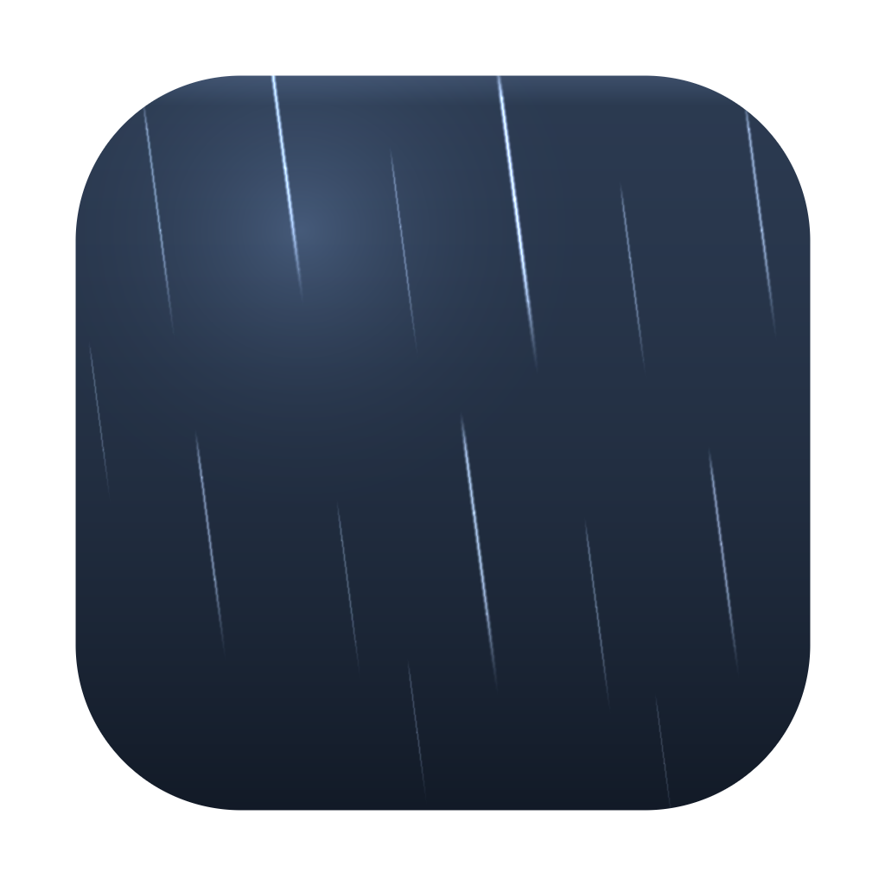

<div align="center">



# Softfall

**Weather for your desktop, and the sound that goes with it.**

A small macOS app. Rain falls over your screen while you work, clicks pass
straight through, and every layer's picture and sound switch on and off
independently. There is a window when you want to change something, and a menu
bar icon for when you do not.

[](https://github.com/zorhehs/softfall/actions/workflows/build.yml)
&nbsp;·&nbsp; macOS 14+ &nbsp;·&nbsp; Universal (Apple silicon + Intel) &nbsp;·&nbsp; MIT

</div>

---

## Install

```sh
brew tap zorhehs/softfall https://github.com/zorhehs/softfall
brew install --cask softfall
```

Or grab the `.zip` from [Releases](https://github.com/zorhehs/softfall/releases),
unzip it, and drag `Softfall.app` to `/Applications`.

The window holds four things: which weather, whether it is running, how much
of it, and how loud. Everything you set once — placement, colour, frame rate,
what happens on battery — is in Settings, behind Command-comma.

Softfall opens its window on first launch. After that the cloud in your menu
bar is the quickest way back to it — click it to show or hide the window,
right-click for pause and scene switching without raising anything. The window
can be closed without stopping the weather, and "Open this window at launch"
turns the opening off if you would rather start quietly.

## What's in it

Three scenes. Each has a picture switch, a sound switch, and one slider for how
much of it there is — and picture and sound are independent, so rain on screen
in silence and rain in your ears over a still desktop are both available.

| | Scene | On screen | In your ears |
|---|---|---|---|
| 🌧 | **Rain** | Falling streaks in three depth bands, bent by a wandering breeze | A noise bed, a low roar underneath, and individual droplets |
| ⚡️ | **Thunder** | The same rain, plus lightning — a flicker up close, a soft bloom far off | Rumble, arriving *after* the flash |
| 🔥 | **Campfire** | Embers lifting off the bottom of the screen | Crackle over a fire's low roar |

Thunder is rain *plus* lightning rather than a scene of its own, which is why
the code keeps two vocabularies: a **scene** is what you pick, a **layer** is
what the engine renders. That way the rain is written once instead of being
duplicated inside a storm.

## The sound is generated, not recorded

There are no audio files in this app. Every sound is synthesised in real time
from filtered noise, and that is a deliberate choice rather than a shortcut:

- **It never loops.** Sample-based ambience repeats every thirty seconds or so,
  and once you notice the seam you cannot un-notice it. There is no seam here.
- **It responds.** The rain slider does not just change the volume — it moves
  filter cutoffs, brings in a low roar, and thins out the individual droplets,
  the way rain actually behaves as it gets heavier.
- **The storm is one system.** Lightning is drawn first; the thunder is handed
  to the audio engine a moment later, and how long you wait is what your ear
  reads as distance. That gap is the whole illusion: light is instant, sound
  takes about three seconds per kilometre.
- **It costs nothing to ship.** The whole app is a few hundred kilobytes.

## Built to be ignored

An ambient app earns its place by not competing for attention.

- **Click-through.** The overlay never takes focus and never intercepts a click,
  a scroll or a gesture.
- **It stays under your menus.** The overlay sits above your windows but below
  the menu bar, the Dock, and any menu you have open. Weather should not land
  on top of something you are trying to read.
- **Behind-windows mode.** Puts the weather on the desktop instead, so you only
  see it in the gaps around what you are actually doing. If motion over your
  work is too much, this is the setting you want.
- **It gets out of the way of full screen.** Turn on *Hide over full-screen
  apps* and films, presentations and full-screen editors are left alone.
- **Calm mode.** Fewer drops, slower fall, softer contrast.
- **You choose the frame rate.** 30, 60, or whatever your display can do. Thirty
  is the default and still reads as continuous motion.
- **You choose how blue the rain is.** How far it can go before it vanishes
  depends entirely on the wallpaper behind it, so it is a slider, not a
  constant somebody guessed.
- **It watches your battery.** Low Power Mode thins the scene and pins the
  frame rate to its floor rather than stopping it. Pausing the animation on
  battery is there too, but **off** by default — being unplugged is not a
  request for an invisible app. Sound always carries on; it is the cheap part.
  Visuals do stop entirely when the display sleeps or the screen locks.
- **It quietens for calls.** When the microphone goes live, Softfall fades
  down to a murmur and comes back up afterwards. It watches the input device
  rather than a list of apps, so it works for Zoom, Meet, FaceTime, Teams,
  Slack huddles, Discord — anything. It follows Apple Music and Spotify too.
- **Sleep timer.** Fades out across the last two minutes rather than cutting
  off, so drifting off doesn't end with a click.
- **It won't show up in screen shares.** The overlay excludes itself from
  screen recording, so your rain stays yours.

Rain is drawn by hand — a pre-rendered streak sprite blitted once per drop,
rotated to face the direction it is actually travelling, stepped by a display
link. That is why wind bends the rain instead of sliding it sideways, and why
the frame rate is yours to choose: 30, 60, or whatever your display can do.
Thirty is the default and still reads as continuous, because a streak is
longer than the distance it falls in one frame. Embers are left to a Core
Animation emitter, which is all a round glow needs. Both stop entirely when
the display sleeps, the screen locks, or nothing is on screen.

## Build it yourself

```sh
git clone https://github.com/zorhehs/softfall.git
cd softfall
Scripts/build-app.sh
open dist/Softfall.app
```

There is no Xcode project — just a Swift package and one shell script that
assembles the bundle. Easier to read, easier to review, and it builds the same
way on a laptop and on CI.

```
Sources/Softfall
├── Audio/     DSP primitives, the synthesis voices, the AVAudioEngine host
├── Visual/    Click-through windows, the rain renderer, lightning
├── Core/      Scene and layer model, saved state, power awareness
└── UI/        The window, the app menu, and the menu bar item
```

## A note on Gatekeeper

Release builds are ad-hoc signed, not notarised — notarisation needs a paid
Apple Developer ID. The Homebrew cask clears the quarantine flag for you on
install, which is the same thing you would do by hand with right-click → Open.

If you install the `.zip` manually, macOS will refuse to open the app on first
launch. Either right-click it and choose **Open**, or run:

```sh
xattr -dr com.apple.quarantine /Applications/Softfall.app
```

Adding a `CODESIGN_IDENTITY` secret and a notarisation step to
`.github/workflows/release.yml` makes all of this unnecessary.

## Roadmap

Work in progress lives on [`develop`](../../tree/develop).

- More scenes: snow, wind over grass, water
- Global hotkey to show and hide everything
- Save your own mixes as named scenes
- Match your actual local weather, opt in
- Warm and dim the scene after sunset
- Per-display layer choices, not just on/off
- Honour the system *Reduce Motion* setting
- A gentle breathing pacer you can overlay
- Unit tests for the DSP, run on every push

## License

MIT — see [LICENSE](LICENSE).
